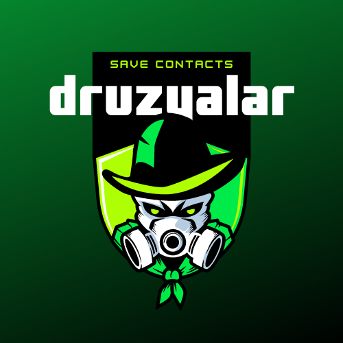

<h1 align="center">Druzyalar Django</h1>

<div align="center" id="top">


&#xa0;

</div>

<p align="center">
  <a href="#dart-about">About</a> &#xa0; | &#xa0; 
  <a href="#sparkles-features">Features</a> &#xa0; | &#xa0;
  <a href="#rocket-technologies">Technologies</a> &#xa0; | &#xa0;
  <a href="#checkered_flag-starting">Starting</a> &#xa0; | &#xa0;
  <a href="https://github.com/komiljonovshohjahon" target="_blank">Author</a>
</p>

<br>

## :dart: About

Django (Python) based applicatopn where the contacts are saved in database. The app is fully functional with all the components inside. Click the "<a target="_blank" href="https://druzyalar.herokuapp.com/">Demo</a>" button and tap to play.

<div align="center">
  

:point_right: <a target="_blank" href="https://druzyalar.herokuapp.com/">Demo</a> :point_left:

</div>

## :sparkles: Features

:heavy_check_mark: Save contact in database;\
:heavy_check_mark: Search by name;\
:heavy_check_mark: Edit or Delete any contact;

## :rocket: Technologies

The following tools were used in this project:

- [Python](https://www.python.org/)
- [Django](https://www.djangoproject.com/)
- [SQLite](https://www.sqlite.org/index.html)

## :checkered_flag: Starting

```bash

# Clone this project
$ git clone https://github.com/komiljonovshohjahon/Contacts-App-Druzyalar.git

# Access
$ cd Contacts-App-Druzyalar

# Install all dependencies
$ pip install -r requirements.txt

# Run the project
$ python manage.py runserver

# Go to the link on the browser
$ http://127.0.0.1:8000/
```

## :memo: Author

Made with :heart: by <a href="https://github.com/komiljonovshohjahon" target="_blank">Shokhjakhon</a>

<a href="#top">Back to top</a>

```

```
